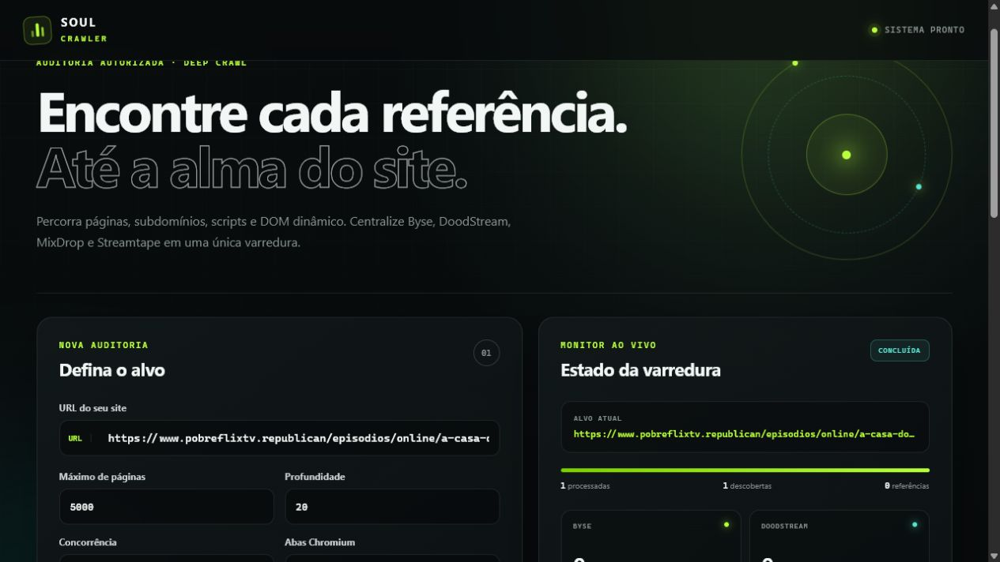
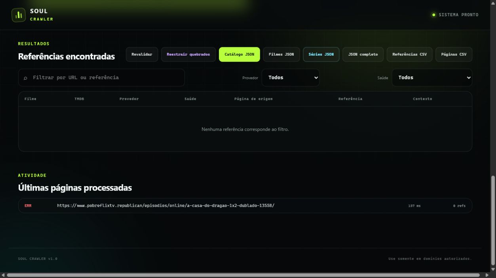

# Soul Scraper

<p align="center">
  <strong>Crawler Python com interface web para auditoria autorizada de players.</strong>
</p>

<p align="center">
  
  
  
  
</p>

O **Soul Scraper** percorre páginas, subdomínios, iframes, scripts, respostas
JSON e DOM dinâmico para localizar referências de **Byse, DoodStream, MixDrop e
Streamtape**. Os resultados são normalizados e exportados em arquivos separados
para filmes, séries e catálogo completo.

> Use somente em domínios que você possui ou tem autorização para auditar.



## Principais recursos

- crawler HTTP assíncrono com concorrência configurável;
- renderização opcional com Chromium para sites dinâmicos;
- descoberta por links, iframes, `data-*`, scripts, CSS, JSON, sitemap e XHR;
- captura de nome, tipo do conteúdo e ID do TMDB;
- separação entre filmes e séries;
- episódios agrupados por série, temporada e número;
- links separados em `dublado`, `legendado` e `nao_identificado`;
- validação de saúde dos links com fallback no navegador;
- perfis **Equilibrado**, **Potente** e **Máximo**;
- exportação simplificada em JSON e relatórios técnicos em JSON/CSV;
- limites de memória e abas para evitar estouro do heap do Chromium.

## Interface

O painel permite controlar profundidade, quantidade de páginas, concorrência,
abas Chromium, timeout e as opções de descoberta.



Ao terminar, a interface disponibiliza estes downloads:

- `catalogo-links.json`: filmes, séries e conteúdos não identificados;
- `filmes-links.json`: somente filmes;
- `series-links.json`: somente séries e seus episódios;
- `resultado.json`: relatório técnico completo;
- `referencias.csv`: todas as referências encontradas;
- `paginas.csv`: páginas processadas, status e tempos.

## Instalação no Windows

Requer Python 3.10 ou superior.

```powershell
git clone URL_DO_REPOSITORIO
cd soulscraper
py -3.10 -m venv .venv
.\.venv\Scripts\python.exe -m pip install --upgrade pip
.\.venv\Scripts\python.exe -m pip install -e ".[render]"
.\.venv\Scripts\python.exe -m playwright install chromium
```

## Como executar

Inicie a interface:

```powershell
.\.venv\Scripts\python.exe -m soulscraper web
```

Depois abra:

```text
http://127.0.0.1:8787
```

No Windows, você também pode dar dois cliques em `iniciar_interface.bat`.

Para encerrar o servidor, pressione `Ctrl+C` no PowerShell.

## Uso pela linha de comando

```powershell
.\.venv\Scripts\python.exe -m soulscraper crawl "https://seu-site.com" `
  --render-js `
  --validate-links `
  --max-pages 5000 `
  --max-depth 20 `
  --concurrency 24 `
  --output ".\resultados\meu-site"
```

Opções úteis:

```text
--subdomains / --no-subdomains
--respect-robots / --ignore-robots
--render-js
--browser-concurrency N
--validate-links
--sitemap / --no-sitemap
--max-pages N
--max-depth N
--concurrency N
--timeout SEGUNDOS
--delay SEGUNDOS
--max-mb N
--output CAMINHO
```

## JSON de filmes

O arquivo `filmes-links.json` é fácil de importar em outro site:

```json
[
  {
    "nome": "Nome do filme",
    "tmdb_id": 123456,
    "tipo": "filme",
    "byse": {
      "dublado": ["https://..."],
      "legendado": ["https://..."],
      "nao_identificado": []
    },
    "doodstream": {
      "dublado": ["https://..."],
      "legendado": [],
      "nao_identificado": []
    },
    "mixdrop": {
      "dublado": ["https://..."],
      "legendado": ["https://..."],
      "nao_identificado": []
    },
    "streamtape": {
      "dublado": ["https://..."],
      "legendado": ["https://..."],
      "nao_identificado": []
    }
  }
]
```

## JSON de séries

O arquivo `series-links.json` mantém cada player associado ao episódio correto:

```json
[
  {
    "nome": "Nome da série",
    "tmdb_id": 94997,
    "tipo": "serie",
    "episodios": [
      {
        "nome": "Nome da série 1x1",
        "temporada": 1,
        "episodio": 1,
        "byse": {
          "dublado": ["https://..."],
          "legendado": ["https://..."],
          "nao_identificado": []
        },
        "doodstream": {
          "dublado": ["https://..."],
          "legendado": ["https://..."],
          "nao_identificado": []
        },
        "mixdrop": {
          "dublado": ["https://..."],
          "legendado": ["https://..."],
          "nao_identificado": []
        },
        "streamtape": {
          "dublado": ["https://..."],
          "legendado": ["https://..."],
          "nao_identificado": []
        }
      }
    ]
  }
]
```

Resultados sem idioma confirmado permanecem em `nao_identificado`. Conteúdos
cujo tipo não pôde ser determinado ficam em `nao_identificados` dentro de
`catalogo-links.json`.

## Tratamento de resultados quebrados

Quando a validação estiver ativa, o crawler classifica os links e permite:

- **Revalidar** os resultados;
- **Reextrair quebrados** diretamente das páginas de origem;
- diferenciar links funcionando, redirecionados, expirados, bloqueados ou com
  timeout.

Para publicar os players em outro site, dê preferência aos resultados com
contexto iniciado por `player-api-` e saúde `working`, `working_browser` ou
`redirected`. Marcadores de texto, URLs incompletas e itens `unchecked` não
devem ser tratados como links reproduzíveis.

## Testes

```powershell
.\.venv\Scripts\python.exe -m pip install -e ".[dev]"
.\.venv\Scripts\python.exe -m pytest -q
```

## Estrutura

```text
soulscraper/
├── crawler.py      # navegação e fila de páginas
├── extractor.py    # extração e metadados
├── reporting.py    # JSON e CSV
├── validator.py    # saúde dos links
├── webapp.py       # API local
└── web/            # interface
```

## Uso responsável

O projeto não quebra autenticação, CAPTCHA, paywall ou outras proteções de
acesso. Comece com concorrência baixa em servidores menores e respeite os
limites do domínio auditado.
