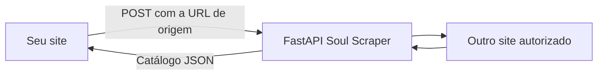

# Soul Scraper

<p align="center">
  <strong>API e crawler Python para encontrar referências de players em domínios autorizados.</strong>
</p>

<p align="center">
  
  
  
  
</p>

O **Soul Scraper** percorre páginas, subdomínios, iframes, scripts, respostas
JSON e DOM dinâmico para localizar referências de **Byse, DoodStream, MixDrop e
Streamtape**. Os resultados podem ser consumidos pela API, pela interface web
ou pela linha de comando.

O uso principal da API é integrar esses resultados ao seu próprio site: o
backend do seu site envia a URL de outro domínio autorizado, a FastAPI faz a
raspagem e o JSON retorna na mesma requisição.

> Use somente em domínios que você possui ou tem autorização para auditar.

## Veja primeiro

O projeto abre o sistema de raspagem diretamente em `/`. A documentação para
integrar a API ao seu próprio site fica em outra tela, acessível pelo botão
**Integração API** ou pela rota `/integracao`.

<table>
  <tr>
    <td></td>
    <td></td>
  </tr>
  <tr>
    <td align="center"><sub>Painel de auditoria e monitoramento</sub></td>
    <td align="center"><sub>Resultados, filtros e downloads</sub></td>
  </tr>
</table>

### Portal de integração da API

Abra `http://127.0.0.1:8787/integracao` para ver exemplos de integração em
JavaScript, PHP, Python e cURL.

## Escolha o modo de uso

| Modo | Quando usar | Como abrir |
| --- | --- | --- |
| **Sistema de raspagem** | Configurar, executar e acompanhar a raspagem | `http://127.0.0.1:8787/` |
| **Portal da API** | Copiar a integração para usar no seu site | `http://127.0.0.1:8787/integracao` |
| **API direta** | Outro site envia uma URL e espera o JSON pronto | `POST /api/v1/scrape` |
| **API assíncrona** | Sites grandes que precisam de progresso e cancelamento | `POST /api/v1/crawls` |
| **CLI** | Automatizar em scripts ou tarefas agendadas | `python -m soulscraper crawl ...` |

## Como o fluxo funciona



## Instalação no Windows

Requisitos: Python 3.10 ou superior.

```powershell
git clone https://github.com/JoaoVRSM/soul-scraper.git
cd soul-scraper
py -3.10 -m venv .venv
.\.venv\Scripts\python.exe -m pip install --upgrade pip
.\.venv\Scripts\python.exe -m pip install -e ".[render]"
.\.venv\Scripts\python.exe -m playwright install chromium
```

Para instalar também as dependências de teste:

```powershell
.\.venv\Scripts\python.exe -m pip install -e ".[dev]"
```

## Inicie a aplicação

### Interface completa

```powershell
.\.venv\Scripts\python.exe -m soulscraper web
```

Abra [http://127.0.0.1:8787](http://127.0.0.1:8787). No Windows, você também
pode executar `iniciar_interface.bat`.

### API e portal de integração

```powershell
.\.venv\Scripts\python.exe -m soulscraper api --port 8787
```

Depois abra:

- Sistema: [http://127.0.0.1:8787](http://127.0.0.1:8787);
- Portal da API: [http://127.0.0.1:8787/integracao](http://127.0.0.1:8787/integracao);
- Swagger: [http://127.0.0.1:8787/docs](http://127.0.0.1:8787/docs);
- OpenAPI: [http://127.0.0.1:8787/api/openapi.json](http://127.0.0.1:8787/api/openapi.json).

No Windows, `iniciar_api.bat` inicia a API automaticamente.

## API direta: envie uma URL e receba JSON

Use `POST /api/v1/scrape` quando o site consumidor puder aguardar a conclusão
da raspagem na mesma requisição. O corpo mínimo é:

```json
{
  "url": "seu-site.com"
}
```

Somente `url` é obrigatório, e o `https://` pode ser omitido. O campo `output`
e as configurações avançadas são opcionais. O `output` aceita:

- `catalog`: filmes, séries e itens não identificados;
- `movies`: somente filmes;
- `series`: somente séries e episódios;
- `full`: relatório técnico completo.

### JavaScript

```javascript
const response = await fetch("https://sua-api.com/api/v1/scrape", {
  method: "POST",
  headers: { "Content-Type": "application/json" },
  body: JSON.stringify({ url: "seu-site.com" })
});

if (!response.ok) throw new Error("A raspagem falhou");
const catalogo = await response.json();
```

### Python

```python
import requests

response = requests.post(
    "https://sua-api.com/api/v1/scrape",
    json={"url": "seu-site.com"},
    timeout=None,
)
response.raise_for_status()
catalogo = response.json()
```

Para receber um arquivo como download, adicione `"download": true`. A resposta
inclui `Content-Disposition` com o nome correto, como `catalogo-links.json`.

## API assíncrona: para sites grandes

Quando não for adequado manter uma requisição aberta, use jobs:

```powershell
$body = @{
  url = "https://seu-site.com"
  max_pages = 500
  max_depth = 10
  concurrency = 12
  browser_concurrency = 2
  render_js = $true
  validate_links = $true
} | ConvertTo-Json

$job = Invoke-RestMethod `
  -Method Post `
  -Uri "http://127.0.0.1:8787/api/v1/crawls" `
  -ContentType "application/json" `
  -Body $body

$id = $job.id
Invoke-RestMethod "http://127.0.0.1:8787/api/v1/crawls/$id"
Invoke-RestMethod "http://127.0.0.1:8787/api/v1/crawls/$id/catalog"
```

Endpoints principais:

| Método | Endpoint | Função |
| --- | --- | --- |
| `GET` | `/api/v1/health` | Verifica a API |
| `POST` | `/api/v1/scrape` | Aguarda e devolve um JSON |
| `POST` | `/api/v1/crawls` | Inicia um job em segundo plano |
| `GET` | `/api/v1/crawls/{id}` | Consulta status e progresso |
| `DELETE` | `/api/v1/crawls/{id}` | Cancela um job ativo |
| `GET` | `/api/v1/crawls/{id}/catalog` | Retorna o catálogo pronto |
| `GET` | `/api/v1/crawls/{id}/movies` | Retorna filmes |
| `GET` | `/api/v1/crawls/{id}/series` | Retorna séries e episódios |
| `GET` | `/api/v1/crawls/{id}/download/{arquivo}` | Baixa JSON ou CSV |

Os jobs ficam em memória e são reiniciados quando o servidor é encerrado. Os
relatórios concluídos permanecem em `resultados/web`.

Para permitir chamadas de um frontend em outra origem:

```powershell
.\.venv\Scripts\python.exe -m soulscraper api `
  --cors-origins "http://localhost:3000,https://seu-frontend.com"
```

## Linha de comando

```powershell
.\.venv\Scripts\python.exe -m soulscraper crawl "https://seu-site.com" `
  --render-js `
  --validate-links `
  --max-pages 5000 `
  --max-depth 20 `
  --concurrency 24 `
  --output ".\resultados\meu-site"
```

Opções úteis: `--subdomains`, `--respect-robots`, `--render-js`,
`--browser-concurrency`, `--validate-links`, `--sitemap`, `--max-pages`,
`--max-depth`, `--concurrency`, `--timeout`, `--delay` e `--max-mb`.

## Arquivos gerados

| Arquivo | Conteúdo |
| --- | --- |
| `catalogo-links.json` | Filmes, séries e itens não identificados |
| `filmes-links.json` | Filmes agrupados por provedor e idioma |
| `series-links.json` | Séries com temporada, episódio e players |
| `resultado.json` | Relatório técnico completo |
| `referencias.csv` | Todas as referências encontradas |
| `paginas.csv` | Páginas processadas, status e tempos |

Os links de idioma ficam separados em `dublado`, `legendado` e
`nao_identificado`. Para resultados publicáveis, prefira saúde
`working`, `working_browser` ou `redirected`.

## Testes

```powershell
.\.venv\Scripts\python.exe -m pytest -q
```

O projeto inclui testes do crawler, extrator, relatórios, validação, painel,
portal de integração da API e endpoint direto de raspagem.

## Estrutura

```text
soulscraper/
├── crawler.py      # navegação e fila de páginas
├── extractor.py    # extração e metadados
├── reporting.py    # JSON e CSV
├── validator.py    # saúde dos links
├── webapp.py       # API REST e rotas das interfaces
└── web/
    ├── index.html  # painel completo
    ├── api.html    # portal de integração
    └── *.css/*.js  # estilos e comportamento
```

## Uso responsável

O projeto não quebra autenticação, CAPTCHA, paywall ou outras proteções de
acesso. Comece com concorrência baixa em servidores menores, respeite
`robots.txt` e audite apenas domínios autorizados.
